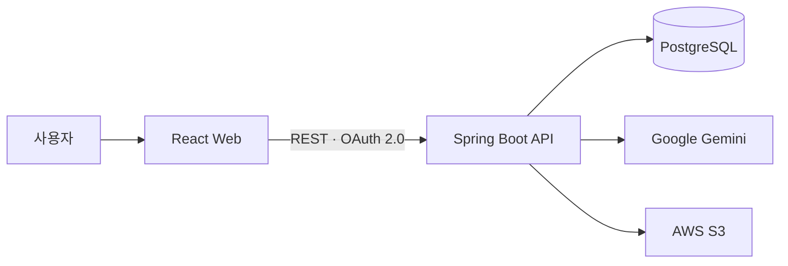

<div align="center">

<h1>하루들 Harudle</h1>

<h3>일상의 놓친 순간을 그림으로</h3>

<p>
오늘의 일을 글로 남기면 그림일기를 만들어 드려요.<br>
일상에서 놓쳤던 순간들을 그림으로 남겨 사람들과 즐겨보세요!
</p>

<br>
<br>

## 하루들은 어떤 서비스인가요?

기록하고 싶은 순간이 있어도 사진을 남기지 않았거나, 직접 그리기 어렵거나, 꾸준히 기록하는 과정이 번거로워 포기하곤 합니다. 하루들은 **짧은 텍스트 하나로 그날의 장면을 다시 만날 수 있게** 만드는 서비스예요.

이름은 `하루 + doodle` 하루하루를 낙서처럼 쌓아 간다는 뜻을 담았습니다.

초기 사용자 검증에서 수동 제작 참여자 16명 중 14명이 결과에 만족했고, 프로토타입은 평균 만족도 4.5/5와 응답자 12명 중 11명의 재사용 의향을 확인했습니다.

<br>
<br>

## Team Harudle

<table>
  <tr>
    <td align="center">
      <a href="https://github.com/rix01">
        <br>
        <strong>이산</strong><br>
        <sub>@rix01</sub>
      </a>
    </td>
    <td align="center">
      <a href="https://github.com/e9ua1">
        <br>
        <strong>아이큐</strong><br>
        <sub>@e9ua1</sub>
      </a>
    </td>
    <td align="center">
      <a href="https://github.com/jason0904">
        <br>
        <strong>캐모</strong><br>
        <sub>@jason0904</sub>
      </a>
    </td>
    <td align="center">
      <a href="https://github.com/2jaeheon">
        <br>
        <strong>초록</strong><br>
        <sub>@2jaeheon</sub>
      </a>
    </td>
    <td align="center">
      <a href="https://github.com/jebiyeon02">
        <br>
        <strong>이현</strong><br>
        <sub>@jebiyeon02</sub>
      </a>
    </td>
  </tr>
</table>

</div>

<br>
<br>

---

<br>
<br>

## 핵심 흐름

| 1. 기록                     | 2. 생성                                             | 3. 보관                                  | 4. 공유                              |
| --------------------------- | --------------------------------------------------- | ---------------------------------------- | ------------------------------------ |
| 하루를 텍스트로 입력합니다. | 이야기를 4개 장면으로 구성하고 이미지를 생성합니다. | 월별 기록과 연속 기록 일수를 확인합니다. | 링크로 완성된 그림일기를 공유합니다. |

로그인 전에는 게스트로 한 번 체험할 수 있고, 
카카오 로그인 후에는 기록을 계속 쌓을 수 있습니다.

<br>
<br>

## 현재 구현

| 영역        | 제공 기능                                                             |
| ----------- | --------------------------------------------------------------------- |
| 인증        | 카카오 OAuth 2.0, JWT Access Token, Refresh Token 쿠키, CSRF 보호     |
| 게스트 체험 | 로그인 없는 게스트 세션과 1회 그림일기 생성                           |
| 일기 생성   | Gemini 기반 4컷 스토리보드·이미지 동기 생성, 멱등성 키, 일일 3회 제한 |
| 기록 관리   | 월별 목록, 상세 조회, 소프트 삭제, 현재 연속 기록 일수                |
| 이미지      | S3 저장과 제한 시간 접근 URL 발급                                     |
| 공유        | 동일한 공유 링크 생성·조회와 인증 없는 공개 결과 조회                 |
| 안정성      | 생성 실패 정리, 장시간 처리 중인 작업 복구, 프롬프트 버전 보존        |

Gemini와 S3 연동은 환경 변수로 활성화합니다. 기본 로컬 설정에서는 외부 생성 어댑터가 비활성화되어 있습니다.

<br>
<br>

## 기술 구성



| 영역      | 기술                                                                      |
| --------- | ------------------------------------------------------------------------- |
| Web       | React 19, TypeScript 6, Webpack 5, Emotion                                |
| API       | Java 21, Spring Boot 4.1, Spring Security, Spring Data JPA, Flyway        |
| Data & AI | PostgreSQL 18, Google Gemini, AWS S3                                      |
| Test      | Jest, Testing Library, MSW, JUnit 6, AssertJ, RestAssured, Testcontainers |
| Delivery  | GitHub Actions, Gradle, pnpm                                              |

<br>

---

<br>

## 로컬에서 시작하기

### 준비물

- Amazon Corretto 21
- Docker와 Docker Compose
- Node.js 24, pnpm 11.20.0


저장소를 내려받습니다.

```shell
git clone https://github.com/woowacourse-teams/2026-Harudle.git
cd 2026-Harudle
```

<br>

### Backend

저장소 루트에서 다음 명령을 실행합니다.

```shell
cd backend
cp .env.example .env
docker compose up -d
./gradlew bootRun
```

실행 전 `backend/.env`의 `DB_PASSWORD`, `KAKAO_REST_API_KEY`, `KAKAO_CLIENT_SECRET`, `JWT_SECRET_BASE64`를 채워야 합니다. Gemini와 S3를 함께 사용하려면 `HARUDLE_GENERATION_ADAPTERS_ENABLED=true`로 변경하고 관련 설정도 입력합니다.

<br>

### Frontend

별도 터미널의 저장소 루트에서 실행합니다.

```shell
cd frontend
pnpm install --frozen-lockfile
pnpm --dir web dev
```

| 주소                                | 용도                 |
| ----------------------------------- | -------------------- |
| `http://localhost:5173`             | 웹 클라이언트        |
| `http://localhost:8080`             | API 서버             |
| `http://localhost:8080/scalar`      | Scalar API 테스트 UI |
| `http://localhost:8080/v3/api-docs` | OpenAPI JSON         |

Scalar와 OpenAPI 문서는 `HARUDLE_API_DOCUMENTATION_ENABLED=true`일 때만 열립니다. 예시 환경 변수 파일은 로컬 문서를 활성화한 상태입니다. JWT & CSRF 흐름과 요청 예시는 [API 명세](./backend/docs/api-spec.md)를 참고해 주세요.

<br>

---

<br>

## 테스트

Backend 테스트는 Testcontainers를 사용하므로 Docker가 필요합니다.

```shell
cd backend
./gradlew test
```

```shell
cd frontend
pnpm --dir web check
```

Pull Request에서는 변경 영역에 맞춰 [GitHub Actions](./.github/workflows/test.yml)가 Backend 또는 Frontend 검증을 실행합니다.

<br>

---

<br>

## 생성 프롬프트 운영 원칙

운영에서 승인한 참조 이미지를 비공개 이미지 저장소에 업로드한 뒤 다음 환경 변수를 주입합니다.

- `HARUDLE_GENERATION_PROMPT_BOOTSTRAP_ENABLED=true`
- `HARUDLE_GENERATION_PROMPT_BOOTSTRAP_STORYBOARD_PROMPT_TEXT`
- `HARUDLE_GENERATION_PROMPT_BOOTSTRAP_IMAGE_STYLE_PROMPT_TEXT`
- `HARUDLE_GENERATION_PROMPT_BOOTSTRAP_IMAGE_ASSET_OBJECT_KEY`

초기화는 `generation_prompts` 테이블이 비어 있을 때만 실행됩니다. 참조 이미지를 읽을 수 없거나 설정이 불완전하면 애플리케이션 시작을 중단하며, 여러 인스턴스가 동시에 시작되어도 한 행만 등록합니다. 실제 프롬프트 본문과 이미지 키는 저장소에 커밋하지 않습니다.

프롬프트를 변경하거나 롤백할 때는 기존 행을 수정하지 않고 새 행을 추가합니다. 가장 큰 ID의 프롬프트가 새 생성 요청에 사용되고, 이전 생성 기록은 당시 프롬프트를 계속 참조합니다.
