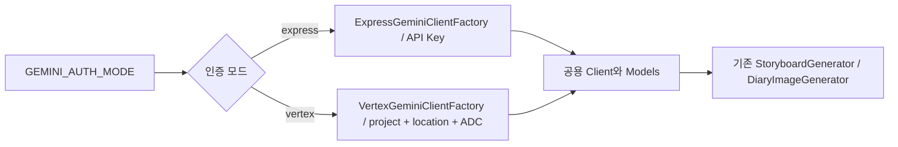

# 하루들 백엔드

Java 21과 Spring Boot 4.1.0 기반의 하루들 백엔드 애플리케이션입니다.

## 기술 스택

- Java 21 (Amazon Corretto)
- Spring Boot 4.1.0
- Spring Web MVC
- Spring Data JPA
- Flyway
- Spring Security
- Spring Security OAuth2 Client & Resource Server
- PostgreSQL 18
- Gradle 9.5.1
- JUnit 6.0.3, AssertJ, Testcontainers

## 사전 준비

- Amazon Corretto 21
- Docker와 Docker Compose 2.2 이상

Gradle은 별도로 설치할 필요가 없습니다. 저장소에 포함된 Gradle Wrapper를 사용합니다.

## 문서

- [API 명세](docs/api-spec.md)

## 도메인 패키지

백엔드는 기능과 데이터 소유권을 기준으로 다음 네 개의 최상위 도메인 패키지로 구성합니다.

```text
com.harudle
├── auth
├── diary
├── generation
└── share
```

| 패키지 | 역할 | 소유 데이터 |
| --- | --- | --- |
| `auth` | 사용자 조회, 카카오 OAuth 로그인, Access/Refresh Token 발급·갱신·폐기 | `users`, `oauth_accounts`, `refresh_tokens` |
| `diary` | 일기 저장, 월간 히스토리와 상세 조회, 소프트 삭제 | `diaries` |
| `generation` | 일일 생성 횟수, 멱등성, AI 생성 상태, 실패 및 고아 작업 복구 | `daily_generation_usage`, `generation_prompts`, `comic_generations` |
| `share` | 성공한 생성 결과의 공유 링크 생성과 인증 없는 공개 조회 | `share_links` |

각 도메인은 구현 규모에 따라 `domain`, `application`, `presentation`, `infrastructure` 하위 패키지로 확장합니다.
AI와 S3 같은 외부 시스템 연동은 독립 도메인으로 만들지 않고 `generation.infrastructure`의 어댑터로 둡니다. 보안 설정,
예외 처리와 같은 횡단 관심사는 도메인에 포함하지 않고 별도의 공통 영역에서 관리합니다.

현재 각 도메인의 `package-info.java`는 클래스가 없는 빈 디렉터리를 Git에 추적하고 역할을 표시하기 위한 임시 파일입니다.
해당 패키지에 실제 구현 클래스가 추가되면 대응하는 `package-info.java`를 삭제합니다.

## 로컬 실행

예시 환경 변수 파일을 복사하고 `DB_PASSWORD`에 추측하기 어려운 로컬 비밀번호를 설정합니다.

```shell
cp .env.example .env
```

Windows PowerShell에서는 다음 명령을 사용할 수 있습니다.

```powershell
Copy-Item .env.example .env
```

PostgreSQL을 실행합니다. Docker Compose는 `backend/.env`를 자동으로 읽으며 데이터베이스 포트는 로컬
인터페이스에만 바인딩됩니다.

```shell
docker compose up -d
```

애플리케이션을 실행합니다.

```shell
./gradlew bootRun
```

Windows PowerShell에서는 다음 명령을 사용할 수 있습니다.

```powershell
.\gradlew.bat bootRun
```

기본 데이터베이스 접속 정보는 다음과 같습니다.

| 환경 변수 | 기본값 |
| --- | --- |
| `DB_HOST` | `localhost` |
| `DB_PORT` | `5432` |
| `DB_NAME` | `harudle` |
| `DB_USERNAME` | `harudle` |
| `DB_PASSWORD` | 기본값 없음, 필수 |

애플리케이션은 실행 디렉터리의 `.env` 파일을 선택적으로 읽습니다. IntelliJ에서 애플리케이션을 직접 실행할 때는 Working
directory를 `backend`로 지정하거나 Run Configuration에 환경 변수를 설정합니다. 운영 환경에서는 `.env` 파일 대신 배포
환경의 Secret 또는 환경 변수로 모든 데이터베이스 접속 정보를 주입합니다.

PostgreSQL 18부터 데이터 볼륨은 `/var/lib/postgresql`에 마운트됩니다. 이전 설정으로 만든 개발용 볼륨을 초기화해도 되는
경우 다음 명령으로 삭제한 뒤 컨테이너를 다시 생성할 수 있습니다.

```shell
docker compose down -v
docker compose up -d
```

이 명령은 기존 로컬 데이터베이스 데이터를 삭제하므로 필요한 데이터가 있다면 먼저 백업합니다.

## Gemini Client 인증

외부 생성 어댑터를 활성화하면 `GEMINI_AUTH_MODE`로 Client 생성 방식을 선택합니다.
기본값인 `express`는 기존 Vertex AI Express API Key 방식을 사용합니다. `vertex`는 GCP 프로젝트와
위치를 지정하고 Application Default Credentials(ADC)로 인증합니다.
인증 모드를 생략하거나 빈 값·공백으로 설정하면 `express`를 사용합니다. 모드 이름의 앞뒤 공백과
대소문자 차이는 허용하며, 지원하지 않는 이름은 애플리케이션 시작 시 설정 오류로 거절합니다.

| 설정 | `express` | `vertex` |
| --- | --- | --- |
| `GOOGLE_API_KEY` (또는 `GEMINI_API_KEY`) | 필수 | 사용하지 않음 |
| `GOOGLE_CLOUD_PROJECT` | 사용하지 않음 | 필수 |
| `GOOGLE_CLOUD_LOCATION` | 사용하지 않음 | 기본값 `global` |
| `GOOGLE_APPLICATION_CREDENTIALS` | 사용하지 않음 | WIF credential configuration 파일의 절대 경로 |

`GeminiClientFactory`의 구현체만 교체되며, 기존 생성 서비스의 `ObjectProvider`와
`StoryboardGenerator` / `DiaryImageGenerator` 인터페이스는 유지됩니다. 모델, 요청 제한 시간,
SDK 재시도 횟수는 기존 설정을 그대로 사용합니다.



Nano Banana 2.1을 표준 Vertex AI에서 사용하려면 다음 환경 변수를 설정합니다. 기존 S3 및 생성
프롬프트 설정도 필요합니다.

```dotenv
HARUDLE_GENERATION_ADAPTERS_ENABLED=true
GEMINI_AUTH_MODE=vertex
GOOGLE_CLOUD_PROJECT=your-gcp-project-id
GOOGLE_CLOUD_LOCATION=global
GOOGLE_APPLICATION_CREDENTIALS=/var/run/harudle/gcp-wif.json
GEMINI_IMAGE_MODEL=gemini-nano-banana-2.1
```

EC2에서는 기존 인스턴스 역할을 허용하는 GCP Workload Identity Federation 공급자와 서비스 계정
권한을 구성하고, AWS용 `external_account` credential configuration 파일을 생성합니다.
프로젝트의 서비스 계정에는 Vertex AI 호출 권한(예: `roles/aiplatform.user`), 허용한 외부 주체에는
해당 서비스 계정의 `roles/iam.workloadIdentityUser` 권한이 필요합니다. 이 파일에는 서비스 계정의
private key를 넣지 않습니다. Java Google Auth 라이브러리가 ADC 파일을 읽어 AWS 임시 자격 증명을
교환하고 GCP 액세스 토큰을 갱신합니다. 별도의 토큰 저장·갱신 코드는 필요하지 않습니다.

EC2 IMDSv2용 파일은 `--aws`와 `--enable-imdsv2`를 함께 지정해 생성합니다.
아래 `PROJECT_NUMBER`는 프로젝트 ID가 아닌 숫자 프로젝트 번호이며, 나머지 자리에는 구성한
Pool·Provider ID와 서비스 계정 이메일을 넣습니다.

```bash
gcloud iam workload-identity-pools create-cred-config \
  "projects/PROJECT_NUMBER/locations/global/workloadIdentityPools/POOL_ID/providers/PROVIDER_ID" \
  --service-account="SERVICE_ACCOUNT_EMAIL" \
  --aws \
  --enable-imdsv2 \
  --output-file="gcp-wif.json"
```

생성된 JSON의 `credential_source.imdsv2_session_token_url` 값이
`http://169.254.169.254/latest/api/token`인지 확인합니다. 이 항목이 없으면 IMDSv2 토큰 없이
메타데이터를 조회하므로 `Http tokens=required`인 EC2에서 401 응답으로 인증에 실패할 수 있습니다.
파일 생성 옵션은 [Google의 AWS WIF 공식 안내](https://docs.cloud.google.com/iam/docs/workload-identity-federation-with-other-clouds)를 참고합니다.

컨테이너에서는 호스트의 credential configuration 파일을 읽기 전용으로 마운트하고
`GOOGLE_APPLICATION_CREDENTIALS`를 컨테이너 내부 경로로 지정합니다. 현재 Compose에는 이
마운트가 없으므로 배포할 때 추가해야 합니다. 컨테이너에서 EC2 IMDS에 접근할 수 있어야 합니다.
Docker bridge 네트워크에서는 [배포 가이드의 EC2 IMDSv2 설정](../deploy/README.md)에 따라
`Metadata response hop limit`을 `2`로 설정하고 `Http tokens=required`를 유지합니다.
GCP WIF 리소스 생성과 운영 Compose 변경은 이 Client 구현에 포함하지 않습니다.

`backend/.env`를 Spring 설정으로 읽는 것만으로는 ADC의 환경 변수가 설정되지 않습니다.
`GOOGLE_APPLICATION_CREDENTIALS`는 Java **프로세스 환경 변수**로 주입해야 합니다. IntelliJ에서는
Run Configuration에 지정하고, PowerShell에서는 다음과 같이 실행합니다.

```powershell
$env:GOOGLE_APPLICATION_CREDENTIALS='C:\credentials\gcp-wif.json'
.\gradlew.bat bootRun
```

Docker의 `env_file`에 지정한 변수는 프로세스 환경으로 전달됩니다. WIF 파일 없이 로컬 개발을 할
때는 `gcloud auth application-default login`으로 생성한 ADC를 사용할 수도 있습니다. Vertex 모드에서
ADC를 찾을 수 없으면 애플리케이션 시작에 실패하며 Express 인증으로 전환하지 않습니다.

공식 안내: [AWS 연동 WIF](https://docs.cloud.google.com/iam/docs/workload-identity-federation-with-other-clouds),
[Nano Banana 2.1 모델](https://docs.cloud.google.com/gemini-enterprise-agent-platform/models/gemini/nano-banana-2-1).

## 테스트

```shell
./gradlew test
```

통합 테스트는 Testcontainers가 PostgreSQL 컨테이너를 실행하므로 Docker가 필요합니다. Docker를 사용할 수 없는
환경에서는 컨테이너 기반 테스트가 자동으로 건너뛰어집니다.

Testcontainers의 PostgreSQL로 애플리케이션을 직접 실행하려면 다음 명령을 사용합니다.

```shell
./gradlew bootTestRun
```

## 기본 정책

- JPA의 Open Session in View는 비활성화되어 있습니다.
- Hibernate는 스키마를 자동 변경하지 않고 시작 시 스키마를 검증합니다.
- 인증 구현 전까지 Spring Security의 기본 보안 설정이 적용되어 모든 API가 보호됩니다.
