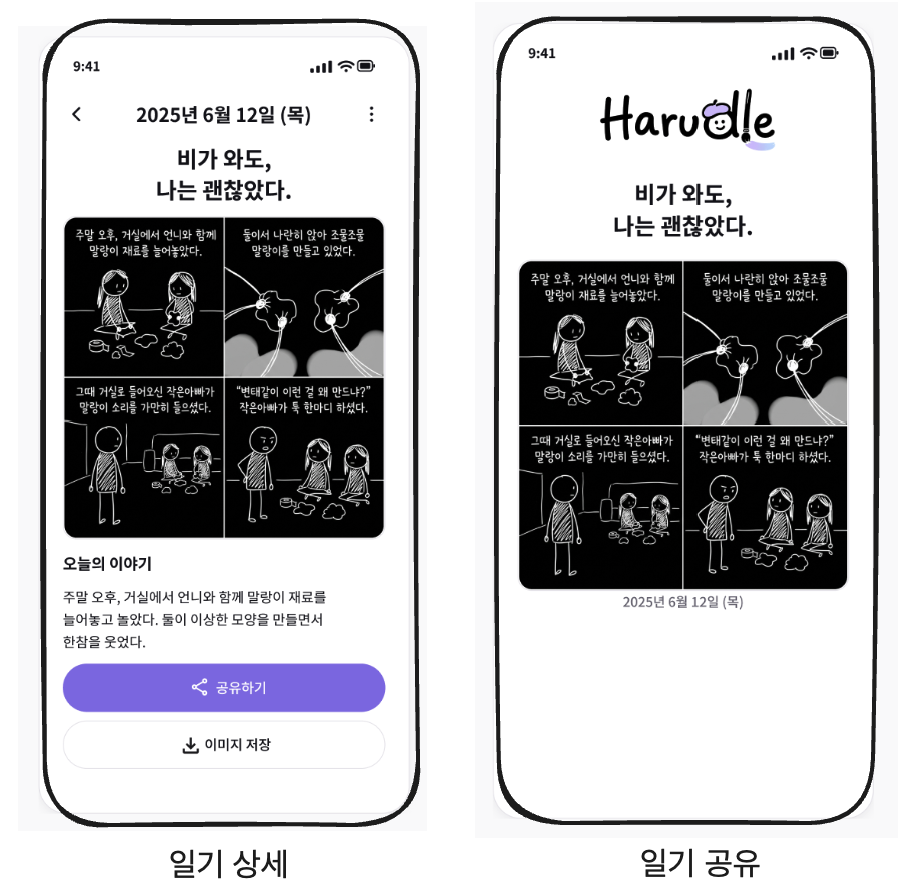

# ADR-0005: 컴포넌트 분리 및 공통화 기준

- **날짜:** 2026-08-11

## 📜 맥락 (Context)

컴포넌트를 어느 수준까지 분리하고 공통화할 것인지에 대한 명확한 기준이 필요했다.

아직 실제 재사용이 발생하지 않은 상태에서 미래의 가능성만으로 공통 컴포넌트를 미리 추출하면, 불필요한 Props가 증가하거나 서로 다르게 발전할 요구사항이 하나의 컴포넌트에 결합될 수 있다.

반대로 재사용 여부만을 컴포넌트 분리 기준으로 삼으면, 한 페이지에서만 사용되는 UI가 복잡한 상태나 이벤트 처리, 애니메이션 등의 독립적인 책임을 가지더라도 부모 컴포넌트에 모든 구현이 집중될 수 있다.

또한, 단순히 시각적으로 유사하다는 이유로 **다른 도메인이거나, 동일한 도메인의 서로 다른 유스케이스**를 하나의 컴포넌트로 묶는 잘못된 결합을 방지할 필요가 있었다.

따라서 재사용 횟수나 UI의 외형만을 기준으로 하지 않고, **컴포넌트의 책임과 변경 이유를 중심으로 분리 및 공통화 여부를 판단하는 일관된 기준**을 확립하고자 한다.

## 🎯 결정 (Decision)

단순한 코드 중복이나 시각적 영역의 분리가 아닌, **독립적인 책임과 변경 이유**를 기준으로 컴포넌트를 분리하고 공통화한다.

구체적으로 다음 3가지 원칙을 따른다.

### 1. 재사용이 직접 확인되기 전에는 미리 추상화하지 않는다

미래에 재사용될 가능성만으로 공통 컴포넌트를 미리 추출하지 않는다.

공통화를 검토하기 시작하는 시점은 다음과 같다.

- 서로 다른 Page에서 2회 이상 반복되는 경우
- 같은 Page 내부에서 3회 이상 반복되는 경우

단, 반복 횟수는 **공통화를 검토하기 위한 신호**일 뿐, 기계적으로 컴포넌트를 추출하는 절대적인 기준으로 사용하지 않는다.

실제 공통화 여부는 반복되는 코드가 **동일한 책임을 가지고 같은 이유로 변경되는지**를 추가로 확인한 뒤 결정한다.

---

### 2. 재사용되지 않더라도 독립적인 책임이 있다면 컴포넌트로 분리한다

컴포넌트 분리를 판단할 때 다음 질문을 사용한다.

> **컴포넌트로 분리했을 때 부모가 몰라도 되는 구체적인 구현이 생기는가?**

다음과 같은 경우에는 재사용 여부와 관계없이 컴포넌트 분리를 고려한다.

- 복잡한 내부 상태나 이벤트 핸들러를 가진 경우
- Loading, Error 등 독립적인 UX 로직을 가진 경우
- 독립적인 CSS Animation 또는 Transition을 가진 경우
- 자체적인 렌더링 조건이나 사용자 Interaction을 가진 경우
- 분리를 통해 부모가 알 필요 없는 구현 세부사항을 감출 수 있는 경우

반대로 단순히 이미지, 텍스트 등 **시각적으로 영역이 나뉜다는 이유만으로는 컴포넌트를 분리하지 않는다.**

---

### 3. 시각적으로 유사하다는 이유만으로 공통화하지 않는다

컴포넌트 공통화를 판단할 때

> **유사하게 생겼는가?**

보다

> **같은 이유로 변경되는가?**

를 더 중요한 기준으로 사용한다.

예를 들어 일기 상세 화면과 공유 화면은 같은 `Diary` 도메인에 속하고 현재 UI도 유사하지만 서로 다른 유스케이스를 가진다.

각 유스케이스의 요구사항이 서로 다른 이유로 변경될 가능성이 있다면 별도의 컴포넌트로 구현한다.

실제 구현 이후 동일한 구조가 반복되고, 해당 구조가 같은 이유로 변경된다는 것이 확인될 경우에만 공통화를 검토한다.

## ⚖️ 결과 (Consequences)

### 긍정적 효과

- 아직 존재하지 않는 요구사항을 예상하여 불필요한 추상화를 만드는 것을 줄일 수 있다.
- 실제 사용 사례가 확인된 이후 추상화하기 때문에 보다 구체적인 요구사항을 바탕으로 적절한 추상화 경계를 찾을 수 있다.
- UI가 비슷하지만 서로 다른 유스케이스가 하나의 컴포넌트에 결합되어 변경 영향 범위가 커지는 것을 방지할 수 있다.
- 재사용되지 않더라도 독립적인 책임을 가진 구현을 하위 컴포넌트로 숨겨 부모 컴포넌트의 복잡도를 낮출 수 있다.
- 컴포넌트의 분리와 공통화 여부를 단순한 크기나 외형이 아닌 책임과 변경 이유를 기준으로 판단할 수 있다.

### 부정적 효과 / 감수할 점

- 공통화 시점을 의도적으로 늦추기 때문에 초기에 일시적인 코드 중복이 발생할 수 있다.
- 중복을 허용한 이후 실제 공통화가 필요해질 경우 별도의 리팩터링 비용이 발생한다.
- `다른 Page 2회`, `같은 Page 3회`라는 기준은 짐작에 가까우므로 모든 상황에 기계적으로 적용할 수 없다.
- 무엇을 독립적인 책임으로 볼 것인지 개발자마다 판단이 달라질 수 있다.
- 반복 횟수만으로 판단할 수 없으므로, 공통화 시 **같은 이유로 변경되는가**에 대한 추가적인 설계 고민이 필요하다.

## 🔄 대안 (Alternatives Considered)

### 대안 1: 모든 시각적 의미 영역을 작은 컴포넌트로 분리

이미지, 텍스트, 진행 표시 등 화면에서 시각적으로 구분되는 영역을 각각 컴포넌트로 분리하는 방식이다.

- **채택하지 않은 이유:** 시각적으로 영역이 나뉜다는 이유만으로 기계적으로 분리하면 독립적인 상태나 책임이 없는 컴포넌트가 과도하게 증가한다. 컴포넌트로 분리했을 때 부모로부터 숨길 수 있는 구현이나 책임이 명확하지 않다면 별도로 분리하지 않는 것이 좋다고 판단했다.

---

### 대안 2: 재사용되는 코드만 컴포넌트로 분리

동일한 UI가 여러 위치에서 반복되는 경우에만 컴포넌트로 추출하고, 한 화면에서만 사용하는 UI는 모두 Page 내부에 유지하는 방식이다.

- **채택하지 않은 이유:** 재사용되지 않더라도 복잡한 Handler, 독립적인 상태, UX Boundary, Animation 등 명확한 책임을 가진 UI가 존재할 수 있다. 재사용성만을 기준으로 삼으면 Page 컴포넌트에 지나치게 많은 구현 세부사항이 집중될 수 있다.

---

### 대안 3: UI가 동일하면 조건부 Props를 활용하여 하나의 컴포넌트 사용

현재 UI가 비슷한 화면이라면 하나의 공통 컴포넌트로 추출하고, 화면별 차이를 Props를 통해 처리하는 방식이다.

예를 들어 서로 다른 유스케이스의 차이를 `isSharePage`, `showDeleteButton` 등의 Props로 표현할 수 있다.

- **채택하지 않은 이유:** 도메인이나 유스케이스 간 기능 차이가 커질수록 조건부 Props와 렌더링 분기가 증가하여 서로 다른 변경 이유를 가진 기능들이 하나의 컴포넌트에 강하게 결합될 가능성이 있다. 따라서 현재의 외형보다는 실제 변경 이유가 공통되는지를 확인한 이후 추상화하기로 결정했다.

## 📎 연관 이슈 및 문서
